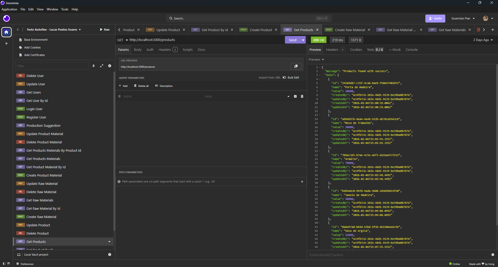
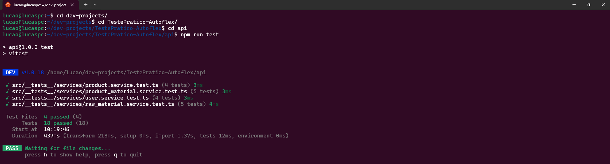
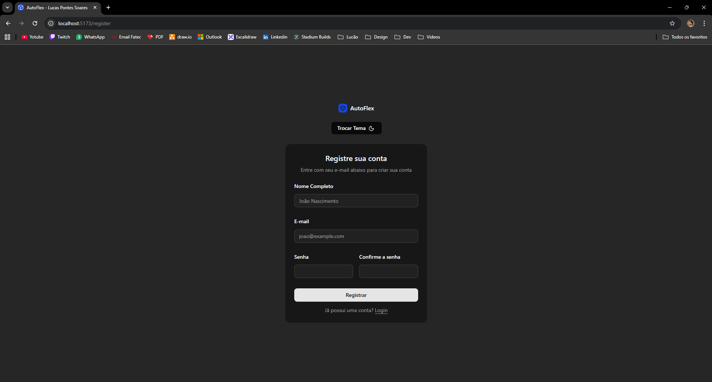
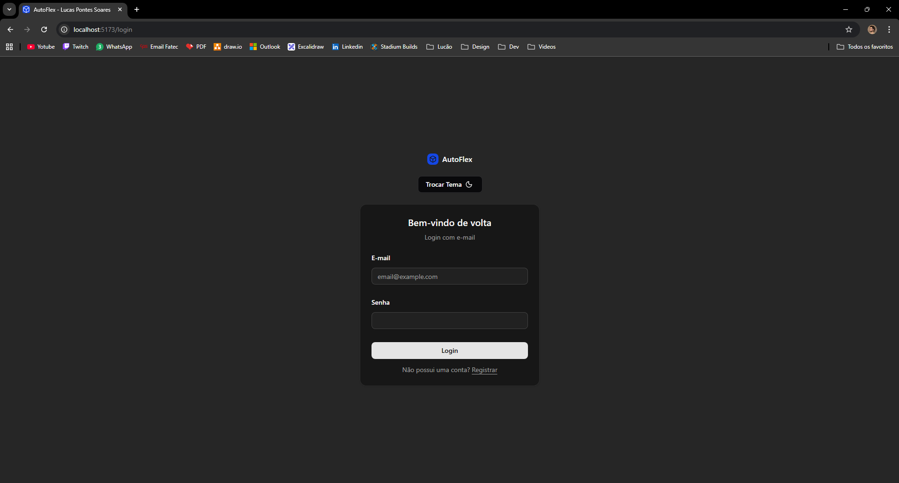
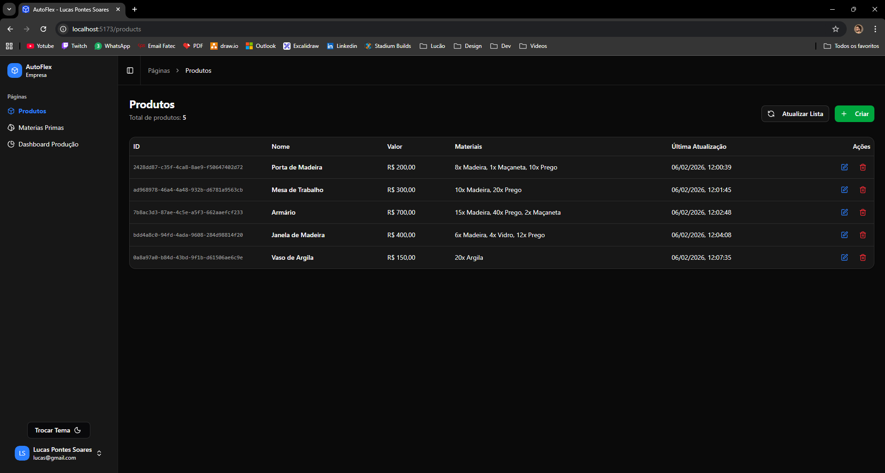
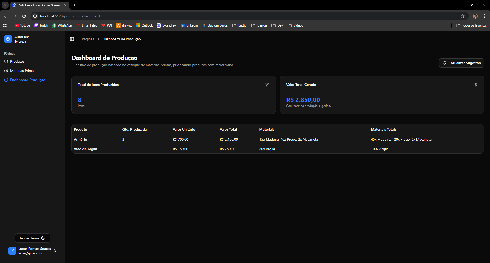
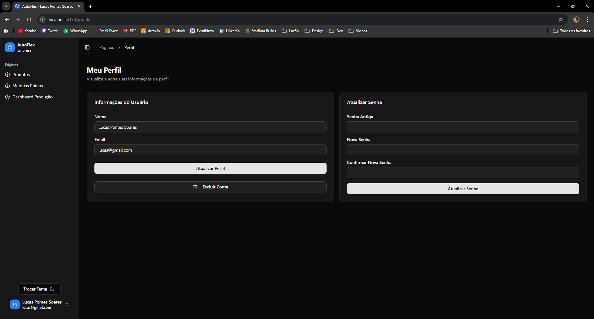
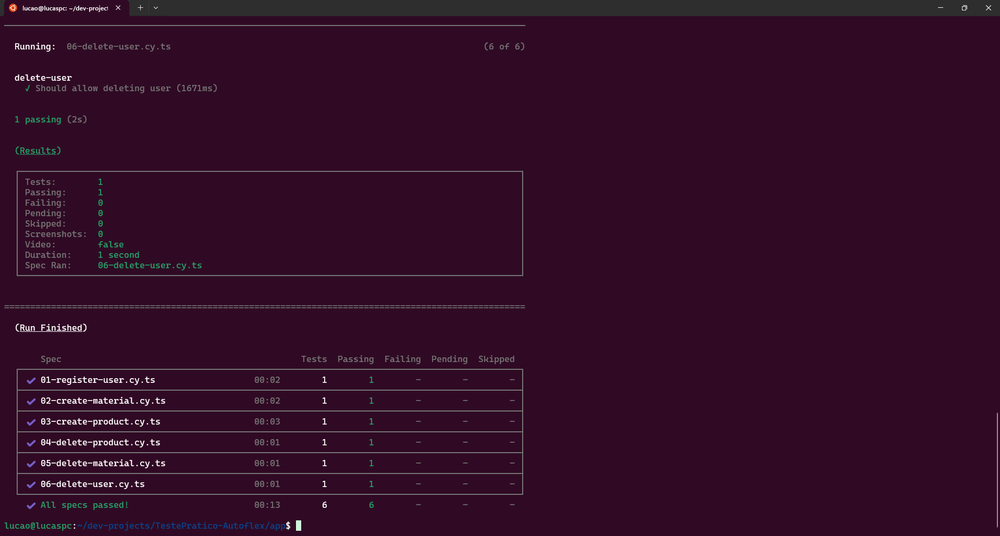

# Teste Prático AutoFlex - Lucas Pontes Soares

## 📋 Sumário

- [🪪 Sobre Mim](#sobre-mim)
   - [📞 Contato](#contato)
- [✨ Principais Implementações](#principais-implementações)
    - [💻 Tecnologias Utilizadas](#tecnologias-utilizadas)
    - [📂 Estrutura](#estrutura)
    - [🌳 GitFlow](#git-flow)
    - [⚙️ Back-end](#back-end)
        - [📁 Estrutura Back-end](#estrutura-back-end)
        - [🖼️ Imagens Back-end](#imagens-backend)
        - [✅ Testes Back-end](#testes-back-end)
    - [🖥️ Front-end](#front-end)
        - [📁 Estrutura Front-end](#estrutura-front-end)
        - [🖼️ Imagens Front-end](#imagens-frontend)
        - [✅ Testes Front-end](#testes-front-end)
- [🚀 Como Rodar](#como-rodar)

## 🪪 Sobre Mim

Sou Lucas Pontes Soares, **Desenvolvedor Full-Stack Júnior** com quase **2 anos de experiência** em **Node.JS**, **React.JS** e gerenciamento de bancos de dados **SQL**.

Habilidade em automação de processos e desenvolvimento de agentes de **IA**.

Com o objetivo em especializar em **Back-end**, busco posição profissional focado em entregar soluções robustas, otimizar processos e contribuir ativamente para o sucesso da equipe.

### 📞 Contato

- 📞 Celular: (14) 98219-7061
- ✉️ Email: <lucasps.dev@outlook.com>
- 👨‍💼 Linkedin: https://www.linkedin.com/in/lucas-pontes-soares/
- 📚 Portfolio: https://lucas-pontes-soares.github.io/portfolio/

## ✨ Principais Implementações

Construi o sistema, separando em duas partes, back-end, e front-end, com as lógicas para **CRUDS**, dos **usuários, produtos, matérias-primas, associar matérias-primas aos produtos, e sugestão de produção**

Utilizei o github como versionamento e organização em diferentes branches seguindo como ideia o **Git Flow**

Realizei **testes unitários no backend** e **testes de integração no frontend**.

### 💻 Tecnologias Utilizadas

- Front-end: React.JS, Typescript, Tawindcss, Docker, Shadcn,ui, Axios, Sonner, Lucide.
- Back-end: Node.JS, Typescript, Express, PostgreSQL, Docker, Drizzle-kit.

### 📂 Estrutura

```
TestePratico-Autoflex/
├── api/    # API REST em Node.js + Express + PostgreSQL + TypeScript
├── app/  # Interface em React + TypeScript
├── images-readme/              # Imagens de referência para o README
└── README.md                 # Arquivo que explica sobre o projeto.
```

### 🌳 GitFlow

Segui a ideia do gitflow, criando branches separadas.

```
TestePratico-Autoflex/
├── main/    # Codigo em produção
├── release/  # Depois que as features são terminadas
├── feature/backend/              # Implementar codigo backend
└── feature/frontend/                 # Implementar codigo frontend
```


Eu desenvolvi nas branchs features, separadas para cada parte.
Quando terminei de desenvolver eu subi para a release.
Ao final depois de testar e validar, eu subo para a main (produção).

### ⚙️ Back-end

🔒 Implementação de criptografia de senha de usuários com bcrypt;

👤 Adicionei um CRUD para usuários, para fazer login, registrar;

🪪 Implementei autenticação com tokens JWT, que expiram e são verificados nas requisições;

🏦 Utilizei banco de dados relacional postreesql com o drizzle-kit;

📖 Criei o diagrama DER do banco de dados relacional. Está disponível em /api/src/db/diagram/Autoflex - Entity Relationship Diagram.drawio;

📚 Criei no Insomnia requisições para todas as rotas. Está disponível em /api/docs/Insomnia Teste Autoflex - Lucas Pontes Soares;

📦 CRUD completo para usuários, produtos, materiais, e produtos_materiais e sugestão de produção.

🔨 Implementei testes unitarios no backend com vitest.

#### 🖼️ Imagens Backend




#### 📁 Estrutura Back-end

```
api/
├── docs/    # Arquivos de documentação
├── node_modules
├── src/              
    ├── __tests__/  # Arquivos para testes unitarios
    ├── db # Configurações do banco de dados
        ├── diagram/
        ├── migrations/
        ├── schema/   
    ├── http/       # Lida com requisições
        ├── controllers/
        ├── schemas/
        ├── services/
    ├── lib/     
    ├── middlewares/ 
└── .env.example # Codigo para copiar para o .env real                
```

#### ✅ Testes Back-end

Realizei testes unitarios no backend, utilizando o **vitest**.

Fiz testes dos CRUDS de cada parte. Separando em diferentes arquivos.

É possível rodá-los, rodando os comandos:

```bash
   cd api
   npm run test
   ```



### 🖥️ Front-end

👤 Criei telas de login e cadastro;

💡 Criei funcionalidade de alternar entre modo claro e escuro;

🪪 Salva o token jwt no local storage;

📦 Telas completas para o CRUD de produtos, matérias-primas, vincular matérias-primas a produtos e sugestão de produção;

💻 Tela para gerenciar conta;

🔨 Implementei testes de integração no frontend com cypress.

#### 🖼️ Imagens Frontend












#### 📁 Estrutura Front-end

```
app/
├── cypress/    # Arquivos de documentação
    ├── e2e/ # Arquivos de teste do cypress
├── node_modules
├── src/              
    ├── components/ # Componentes reutilizavies
        ├── ui/  # Componentes do shadcn
    ├── hooks/ # Hooks do shadcn
    ├── lib/
    ├── pages/  # Paginas .tsx em si
    ├── styles/ # Codigo CSS          
└── .env.example # Codigo para copiar para o .env real                
```

#### ✅ Testes Front-end

Realizei testes de integração no front, utilizando o **cypress**.

Fiz testes dos CRUDS de cada parte. Separando em diferentes arquivos, e depois excluindo os dados que foram testados.

É possível rodá-los, rodando os comandos:

```bash
   cd app
   npm run test
   ```



## 🚀 Como Rodar

Para rodar o sistema, tenha o docker instalado, para gerenciar os containers.

- Rodar primeiro backend:

```bash
   cd api
   cp .env.example .env
   docker-compose up --build
   ```

A API fica disponível em http://localhost:3000

- Depois rodar frontend:


```bash
   cd app
   cp .env.example .env
   docker-compose up --build
   ```

O sistema fica disponível em http://localhost/login

- Acessando:

Acesse:

http://localhost/register

Crie sua conta e, depois, já poderá gerenciar o sistema, produtos e materiais.